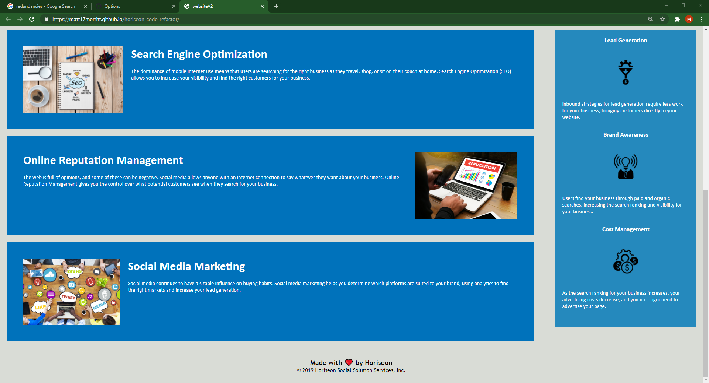

### Matthew-horiseon-code-refactor - Deployed Homework Assignment

## Overview

Upon review of this project, the reader will find an overhaul of the source code that includes semantic elements in the html file, alt tags associated with images to improve accesibility to users, and a css stylesheet that has been rid of redundancies and overlapping classes/ids. The formatting of both the html and css has been changed to better line up with eachother in order to increase readability and allow for future changes. Finally, comments have been added to both the html and css detailing what has been refactored and how the website operates.

## Horiseon-code-refactor Webpage Link

You can find the webpage below:  
https://matt17merritt.github.io/horiseon-code-refactor/

## Screenshots 

## Credits

https://www.w3schools.com/html/html5_semantic_elements.asp

## MIT Liscence

MIT License

Copyright (c) [2020] [Matthew Merritt]

Permission is hereby granted, free of charge, to any person obtaining a copy
of this software and associated documentation files (the "Software"), to deal
in the Software without restriction, including without limitation the rights
to use, copy, modify, merge, publish, distribute, sublicense, and/or sell
copies of the Software, and to permit persons to whom the Software is
furnished to do so, subject to the following conditions:

The above copyright notice and this permission notice shall be included in all
copies or substantial portions of the Software.

THE SOFTWARE IS PROVIDED "AS IS", WITHOUT WARRANTY OF ANY KIND, EXPRESS OR
IMPLIED, INCLUDING BUT NOT LIMITED TO THE WARRANTIES OF MERCHANTABILITY,
FITNESS FOR A PARTICULAR PURPOSE AND NONINFRINGEMENT. IN NO EVENT SHALL THE
AUTHORS OR COPYRIGHT HOLDERS BE LIABLE FOR ANY CLAIM, DAMAGES OR OTHER
LIABILITY, WHETHER IN AN ACTION OF CONTRACT, TORT OR OTHERWISE, ARISING FROM,
OUT OF OR IN CONNECTION WITH THE SOFTWARE OR THE USE OR OTHER DEALINGS IN THE
SOFTWARE.

